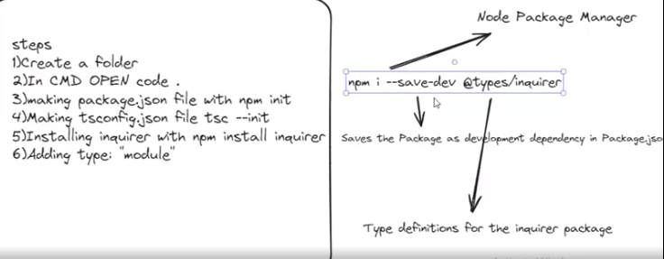
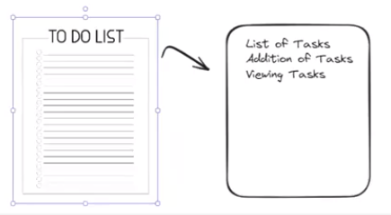
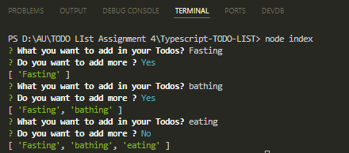

# Typescript-TODO-LIST

Write your code and run it in the terminal using "tsc && node index.js" command.
The Outout will follow the following steps mentioned in the image below:

Here is the output:

